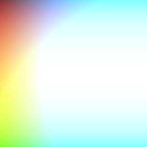

# Random Art
Create art!
## Description
The sublime beauty of generated art

## Normal Mode

You are going to make random art, inspired by
[random-art.org](http://www.random-art.org/). This project comes
with a file `create_art.py`. This file expects a module called
`random_art` with two functions:

* `create_expression()`: this function takes no arguments and returns
  an expression that will generate a number between -1.0 and 1.0, given
  `x` and `y` coordinates.

* `run_expression(expression, x, y)`: this function takes an expression
  created by `create_expression` and an `x` and `y` value. It runs the
  expression, passing the `x` and `y` values to it and returns a value
  between -1.0 and 1.0.

### What's an expression?

I'm super-glad you asked! It is a way for you to create a formula for your
random art. You can define it however you like. Perhaps it's just a function
and `run_expression` just runs it. Maybe it's an [abstract syntax tree][] and
`run_expression` walks the tree and evaluates it. Maybe it's Python code in
a string that you call `eval` on. You have to figure this part out, and it's
one of the harder parts of this exercise.

This image was created with the following expression:

expr1 = lambda x, y: sin(x) + cos(y) + sin(x) + cos(sin(tan(x)))
  expr2 = lambda x, y: cos(tan(y))
  expr3 = lambda x, y: sin(y) + cos(x) + sin(x) + cos(sin(tan(y)))
  return random.choice([expr1, expr2, expr3])

  Seed: 4140325154512360605
  color-4140325154512360605-0.png:
    red: <function create_expression.<locals>.<lambda> at 0x1024d70d0>
    green: <function create_expression.<locals>.<lambda> at 0x1024d71e0>
    blue: <function create_expression.<locals>.<lambda> at 0x1024d7048>

`create_art.py` takes several command-line parameters you may want to use.

* `--seed SEED` sets the random seed to a particular number. This is great for
being able to generate the same image more than once.

* `-n NUM` or `--number NUM` sets how many images to create. `NUM` is 1 by
default.

* `--gray` or `--color` sets whether the image is in grayscale or color.
Color is default.

## Credit

Modified from [a "nifty assignment" from the annual SIGCSE meeting](http://nifty.stanford.edu/2009/stone-random-art/).
